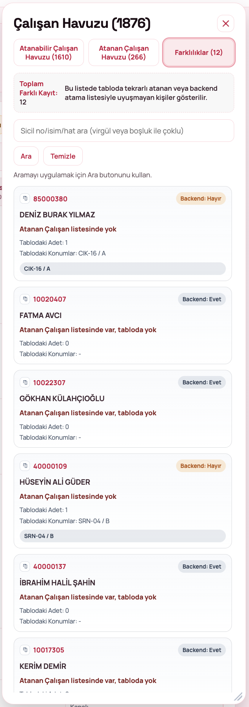
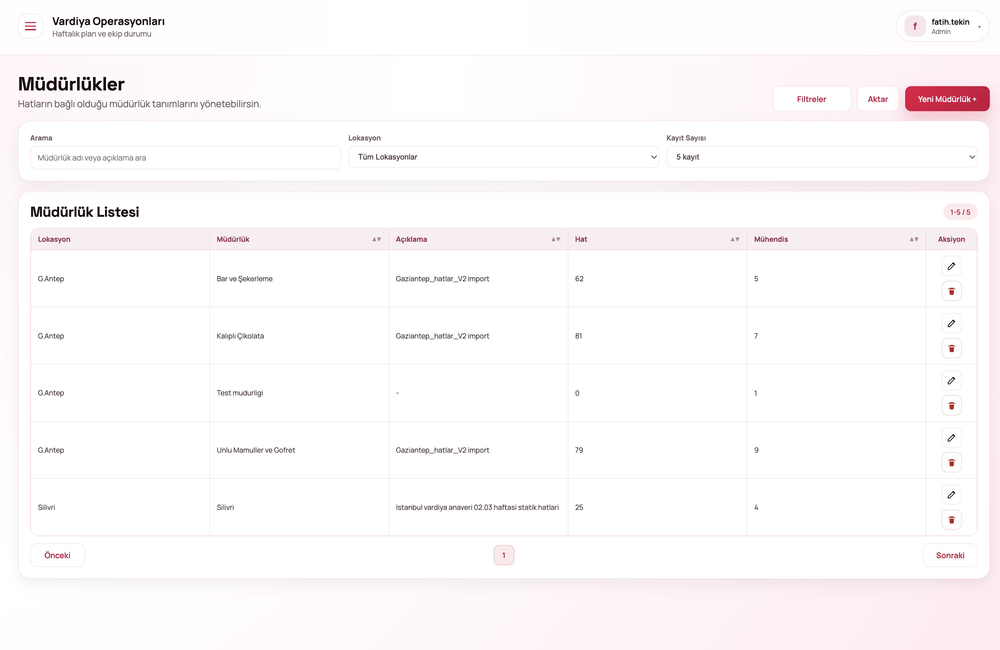
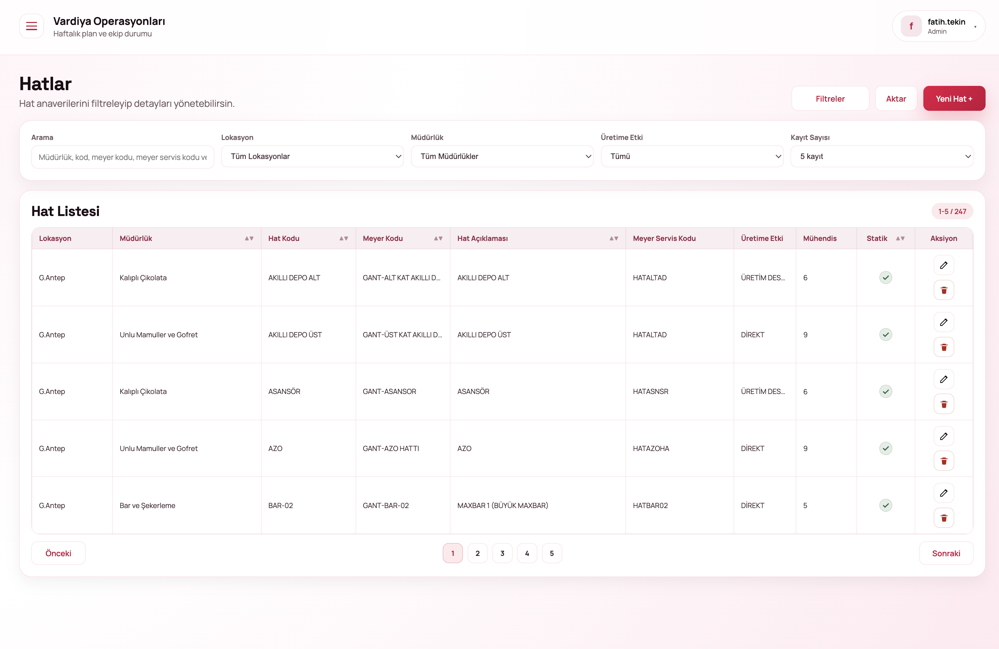
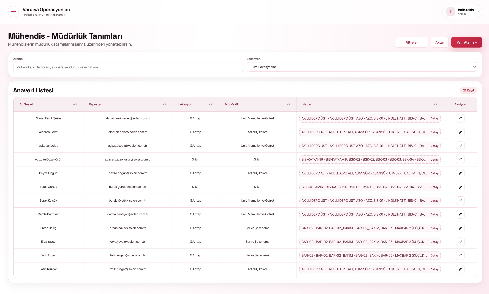
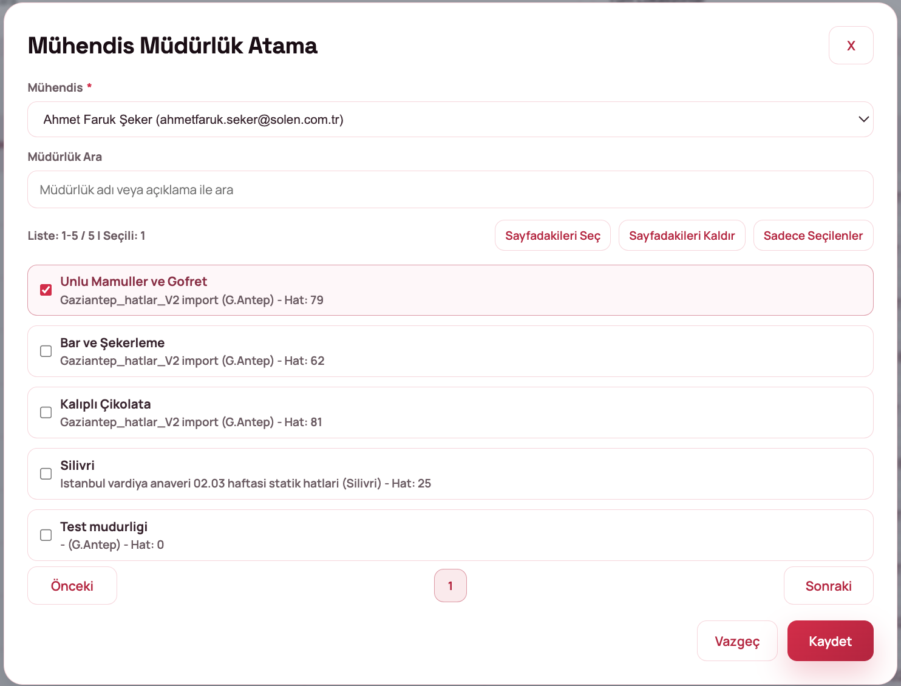
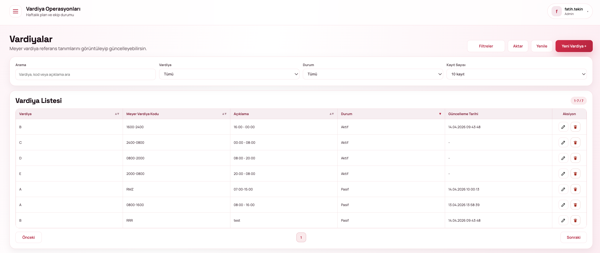

# MÜDÜR

## 1.**Ana Sayfa / Dashboard**&#x20;

Sisteme giriş yapıldığında kullanıcıyı genel durum ekranı karşılar.

<figure><figcaption></figcaption></figure>

#### Sol Menü

Kullanıcının yetkisine göre aşağıdaki modüllere erişim sağlanır:

* Dashboard
* İcmal
* Admin Paneli
* Müdürlükler
* Hatlar
* Mühendis-Müdürlük
* Hat-Sipariş
* Kullanıcı Yetki
* Çalışan Bilgileri
* Kurallar
* Vardiyalar
* Mail Alıcıları

#### Üst Menü

* Kullanıcı bilgisi (sağ üst)
* Şifre değiştir / çıkış yap seçenekleri

Dashboard, haftalık operasyonel verilerin özetini sunar.

<figure><figcaption></figcaption></figure>

#### Gösterilen Veriler

* Aktif Personel
* Atanan Personel
* Planlanan Mesai (Saat)
* Fazla Mesai (Saat)

#### Filtre Alanları

* Başlangıç Tarihi
* Bitiş Tarihi
* İcmal Haftası
* Lokasyon

#### KPI Kartları

* Vardiya listesi tamamlanma oranı
* Hat doluluk oranı
* Gelmeyen ekip oranı
* Mevcut - plan farkı

#### İşlemler

* **Excel’e Aktar:** Verileri dışa aktarır
* **Raporu Yenile:** Güncel veri getirir

### **1.2. Şifre Değiştirme Ekranı**

Kullanıcılar, sistemdeki şifrelerini güvenli şekilde güncelleyebilir.

#### Erişim

* Sağ üst köşede yer alan kullanıcı menüsüne tıklanır
* Açılan menüden **“Şifre Değiştir”** seçilir

<figure><figcaption></figcaption></figure>

#### Alanlar

* **Mevcut Şifre:** Halihazırda kullanılan şifre girilir
* **Yeni Şifre:** Belirlenen yeni şifre girilir
* **Yeni Şifre (Tekrar):** Yeni şifre doğrulama amacıyla tekrar girilir

#### İşlemler

* **Şifreyi Güncelle:** Şifre değişikliğini kaydeder
* **Vazgeç:** İşlemi iptal eder

## **2. İcmal Ekranı**

İcmal ekranı, haftalık vardiya özetlerinin listelendiği alandır.

<figure><figcaption></figcaption></figure>

Kayıtlar; yıl, hafta bilgisi, lokasyon, personel sayısı aralıkları ve açık vardiya durumuna göre filtrelenebilmektedir.

Her bir satırda; icmal başlangıç ve bitiş tarihi, lokasyon bilgisi, atanan/toplam personel sayısı ve A-B-C-D-E vardiya durumları görüntülenmektedir.

#### Aksiyonlar

* 👁 **İcmal Detay:** Icmal detay sayfasi görüntüleme.
* 👥 **Vardiya Atama:** Vardiya atama ekranına geçiş yapilir.
* ✔ **İcmal Onay:** Onaylama işlemi yapilir.

### **2.1. İcmal Oluşturma**

Yeni icmal kaydı oluşturmak için kullanılır.

<figure><figcaption></figcaption></figure>

#### Alanlar

* **Lokasyon:** İcmal oluşturulacak bölge
* **İcmal Başlangıç (Hafta):** Başlangıç tarihi
* **İcmal Bitiş:** Otomatik hesaplanır

#### Bilgilendirme

* SAP üzerinden veri çekildiği için işlem sürebilir
* İşlem süresince pencere açık kalmalıdır

#### İşlemler

* **SAP’dan Getir ve Oluştur:** İcmali oluşturur
* **Vazgeç:** İşlemi iptal eder

### **2.2. Vardiya Atama Ekranı**

Seçilen icmale ait vardiya planlamasının yapıldığı ana ekrandır.

Üst alanda; icmale ait hafta ve tarih aralığı bilgisi, toplam personel sayısı ve onay durumu görüntülenmektedir.

<figure><figcaption></figcaption></figure>

Her hat için aşağıdaki bilgiler yer almaktadır:

* Hat adı ve açıklaması
* A / B / C / D / E vardiyaları
* Atanan personel listesi
* Hedef doluluk oranı

#### İşlemler

* Hücre bazlı çalışan atama
* Çalışan çıkarma
* Vardiya bazlı kontrol

#### 2.2.1. Çalışan Havuzu-**Atanabilir Çalışanlar**

Seçilen hücreye atanabilecek çalışanların listesi görüntülenir.

* Sicil numarası, isim veya hat bilgisine göre arama yapılabilmektedir
* Çoklu seçim özelliği mevcuttur

**Çalışan bilgileri kapsamında; sicil numarası, ad-soyad ve hak edilen değer bilgileri görüntülenmektedir.**

**İşlemler:**

* **Seçili Hücreye Ekle:** Seçilen çalışanı ilgili vardiyaya atar
* **Tümünü Seç / Temizle:** Tüm kayıtları seçer veya mevcut seçimi kaldırır

<figure><figcaption></figcaption></figure>

#### 2.2.2. Çalışan Havuzu- **Atanan Çalışanlar**

Mevcut vardiyaya atanmış çalışanları listeler.

Sicil numarası, ad-soyad, önceki hat/vardiya bilgisi ve hak edilen değer bilgileri görüntülenmektedir.

<figure><figcaption></figcaption></figure>

#### 2.2.3. Çalışan Havuzu- **Farklılıklar Ekranı**

Sistem ile tablo arasında uyumsuz olan kayıtları gösterir.

Backend ve tablo verileri arasında uyumsuzluk bulunan kayıtlar; backend’de olup tabloda yer almayanlar ile tabloda yer alıp backend’de bulunmayanlar şeklinde sınıflandırılmaktadır.

Sicil numarası, ad-soyad, durum bilgisi ve tablo konumları görüntülenmektedir.

<figure><figcaption></figcaption></figure>

#### 2.2.4 Çalışan Havuzu-Çalışan Atama

Çalışanlar vardiyalara iki şekilde atanabilir:

&#x20;**Sürükle – Bırak (Drag & Drop)**

1. Vardiya tablosundan bir hücre seçilir
2. Çalışan havuzundan çalışan seçilir
3. Çalışan, ilgili vardiyaya sürüklenip bırakılır

**Çoklu Seçim ile Atama**

* Birden fazla çalışan seçilir
* Seçilen çalışanlar toplu olarak atanır

**Önemli Notlar**

* Atama yapılmadan önce hedef vardiya seçilmelidir
* Kurallara uymayan çalışanlar atanamaz
* Aynı çalışan birden fazla vardiyaya atanamaz (kurala bağlı)

## **3. Admin Paneli**

Sistem yönetimi için kullanılan merkezi alandır.

Aşağıdaki tanımlama ekranları üzerinden sistem yapılandırmaları gerçekleştirilmektedir:

* Müdürlükler
* Hatlar
* Mühendis–Müdürlük eşleşmeleri
* Hat–Sipariş
* Kullanıcı yetkilendirme
* Çalışan bilgileri
* Çıkışı verilen personeller
* Kurallar
* Vardiyalar
* Mail alıcıları
* Audit logları

#### **Kullanıcı Özeti**

Kullanıcılara ait genel istatistikler bu alanda görüntülenmektedir:

* Toplam kullanıcı sayısı
* Aktif kullanıcı sayısı
* Admin / Müdür / Mühendis / Operatör rol dağılımı

<figure><figcaption></figcaption></figure>

### **3.1. Müdürlükler**

Müdürlükler ekranı, hatların bağlı olduğu müdürlüklerin tanımlandığı ve yönetildiği alandır.

Bu ekranda; müdürlük adı veya açıklamaya göre arama, lokasyon bazlı filtreleme ve kayıt sayısı seçimi yapılabilmektedir.

Müdürlük listesinde lokasyon, müdürlük adı, açıklama, bağlı hat sayısı ve mühendis sayısı bilgileri görüntülenir.

Düzenle ve sil aksiyonları ile kayıtlar yönetilirken, üst alanda yer alan filtreler, dışa aktarma ve yeni müdürlük oluşturma işlemleri gerçekleştirilebilmektedir.

<figure><figcaption></figcaption></figure>

#### **3.1.1. Yeni Müdürlük Ekle**

Yeni bir müdürlük tanımlamak için kullanılır.

#### Alanlar

* **Lokasyon**\*: Müdürlük lokasyonu seçilir
* **Müdürlük Adı**\*: Müdürlük ismi girilir
* **Açıklama:** Opsiyonel açıklama alanı

#### İşlemler

* **Kaydet:** Müdürlük oluşturulur
* **Vazgeç:** İşlem iptal edilir

<figure><figcaption></figcaption></figure>

### **3.2. Hatlar**

Hatlar ekranı, üretim hatlarının listelendiği ve yönetildiği alandır.

Bu ekranda; hat, müdürlük veya kod bilgilerine göre arama yapılabilir, lokasyon, müdürlük ve üretime etki kriterlerine göre filtreleme uygulanabilir ve kayıt sayısı seçilebilir.

<figure><figcaption></figcaption></figure>

Listede aşağıdaki bilgiler yer alır:

* **Lokasyon** (zorunlu): Hattın bağlı olduğu üretim lokasyonu seçilir
* **Müdürlük**(zorunlu): Hattın bağlı olduğu müdürlük bilgisi seçilir
* **Statik durumu**: Hattın aktif veya pasif olduğunu belirler (Aktif/Pasif toggle)
* **Hat kodu**(zorunlu): SAP sisteminde tanımlı olan hat kodudur
* **Meyer kodu**: Hattın Meyer sistemindeki karşılık gelen kod bilgisidir
* **Meyer servis kodu**: Vardiya bilgisinin Meyer sistemine kaydedilmesi sırasında kullanılan servis kodudur
* **Üretime etki**(zorunlu): Hattın üretim sürecine etkisini belirtir
* **Hat açıklaması**: Hat ile ilgili açıklayıcı bilgi girilir

Düzenle ve sil aksiyonları ile kayıtlar yönetilirken, üst alanda yer alan dışa aktarma ve yeni hat oluşturma işlemleri gerçekleştirilebilmektedir.

#### **3.2.1. Yeni Hat Ekle**

Yeni üretim hattı tanımlamak için kullanılır.

<figure><figcaption></figcaption></figure>

#### Alanlar

* **Lokasyon** (zorunlu): Hattın bağlı olduğu üretim lokasyonu seçilir
* **Müdürlük**(zorunlu): Hattın bağlı olduğu müdürlük bilgisi seçilir
* **Statik durumu**: Hattın aktif veya pasif olduğunu belirler (Aktif/Pasif toggle)
* **Hat kodu**(zorunlu): SAP sisteminde tanımlı olan hat kodudur
* **Meyer kodu**: Hattın Meyer sistemindeki karşılık gelen kod bilgisidir
* **Meyer servis kodu**: Vardiya bilgisinin Meyer sistemine kaydedilmesi sırasında kullanılan servis kodudur
* **Üretime etki**(zorunlu): Hattın üretim sürecine etkisini belirtir
* **Hat açıklaması**: Hat ile ilgili açıklayıcı bilgi girilir

#### İşlemler

* **Kaydet**
* **Vazgeç**

### **3.3. Mühendis - Müdürlük Tanımları**

Mühendislerin hangi müdürlüklere bağlı olduğunu yönetmek için kullanılır.

* Mühendis adı veya e-posta bilgisine göre arama yapılabilir
* Lokasyona göre filtreleme yapılabilir

Listede; ad-soyad, e-posta, lokasyon, müdürlük ve bağlı hat bilgileri görüntülenmektedir.

Bu alanda, düzenle/atama güncelle işlemi ile mevcut atama bilgileri güncellenebilir. Üst alanda yer alan filtreler ile gelişmiş filtreleme yapılabilir, aktar seçeneği ile liste dışa aktarılabilir ve yeni atama seçeneği ile yeni kayıt oluşturulabilir.

<figure><figcaption></figcaption></figure>

### **3.3.1. Mühendis Müdürlük Atama**

Bir mühendise müdürlük ataması yapmak için kullanılır.

<figure><figcaption></figcaption></figure>

#### Alanlar

* **Mühendis**\*: Seçilecek mühendis
* **Müdürlük Ara:** Liste içinde arama yapılabilir

#### Liste Özellikleri

* Çoklu müdürlük seçimi yapılabilir
* Sayfa bazlı seçim yapılabilir
* “Sadece seçilenler” filtresi kullanılabilir

#### İşlemler

* **Kaydet:** Atama işlemi tamamlanır
* **Vazgeç:** İşlem iptal edilir

### **3.4. Kullanıcı Tanımlama & Yetkilendirme**

Sistemdeki kullanıcıların oluşturulduğu ve yetkilendirildiği ekrandır.

Bu ekranda; kullanıcı adı veya e-posta bilgisine göre arama yapılabilir, rol ve lokasyon bazlı filtreleme uygulanabilir.

Listede rol, lokasyon, kullanıcı adı, e-posta, ad-soyad ve telefon bilgileri görüntülenmektedir. Düzenle, şifre işlemleri ve sil aksiyonları ile kullanıcı kayıtları yönetilir

Üst alanda yer alan aktar, yenile ve yeni kullanıcı oluşturma işlemleri gerçekleştirilebilmektedir.

<figure><figcaption></figcaption></figure>

#### **3.4.1. Yeni Kullanıcı Ekle**

Yeni kullanıcı oluşturma ekranıdır.

* **Kullanıcı adı**\*: Sistemde kullanılacak benzersiz kullanıcı adı girilir
* **E-posta**\*: Kullanıcıya ait geçerli e-posta adresi girilir
* **Ad**\*: Kullanıcının adı girilir
* **Soyad**\*: Kullanıcının soyadı girilir
* **Rol**: Kullanıcıya atanacak rol seçilir
* **Lokasyon**\*: Kullanıcının bağlı olduğu lokasyon seçilir
* Cep telefonu: Kullanıcının cep telefonu numarası girilebilir
* Telefon: Sabit telefon bilgisi girilebilir

\* işaretli alanlar zorunludur.

* **Kullanıcıyı Oluştur:** Girilen bilgiler ile yeni kullanıcı kaydı oluşturulur
* **Vazgeç:** Yapılan işlemler iptal edilir

<figure><figcaption></figcaption></figure>

### **3.5. Hat - Sipariş**

Hatlara ait sipariş verilerinin görüntülendiği ekrandır.

Bu ekranda; hat ve malzeme bilgilerine göre arama yapılabilir, vardiya, lokasyon, yıl ve hafta bazlı filtreleme uygulanabilir ve kayıt sayısı seçilebilir.

Listede aşağıdaki bilgiler yer almaktadır:

* Lokasyon
* Hat
* Planlama numarası
* Malzeme
* Malzeme kısa metni
* Miktar
* Birim
* Personel
* Başlangıç / bitiş tarihleri

**İşlemler:**

* **Filtreyi Uygula:** Seçilen filtrelere göre verileri listeler
* **Temizle:** Uygulanan filtreleri sıfırlar
* **Aktar:** Listeyi dışa aktarır

<figure><figcaption></figcaption></figure>

### **3.6. Kurallar**

Kurallar ekranı, vardiya planlamasında uygulanacak iş kurallarının yönetildiği alandır.

* Personel atama, vardiya kısıtları ve özel durumlar için sistem kuralları tanımlanır
* Sistem, bu kurallara göre hatalı veya uyarı durumlarını kontrol eder

Bu ekranda; kural adı veya açıklamaya göre arama yapılabilir, aktif/pasif durumuna göre filtreleme uygulanabilir ve kayıt sayısı seçilebilir.

Kural listesinde:

* Kural adı
* Durum (Aktif/Pasif)
* Tür (Hata / Uyarı)
* Açıklama
* Kural ayarları

bilgileri görüntülenmektedir.

Düzenle, aktif/pasif yap ve sil aksiyonları ile kurallar yönetilebilmektedir.

* **Aktar:** Listeyi dışa aktarır
* **Yenile:** Listeyi günceller
* **Yeni Kural +:** Yeni kural kaydı oluşturur

<figure><figcaption></figcaption></figure>

#### **3.6.1. Yeni Kural Ekle**

Yeni bir iş kuralı tanımlamak için kullanılır.

* **Kural tipi**\*: Önceden tanımlı kural şablonlarından seçim yapılır
* **Kural kodu**\*: Kuralı sistemde benzersiz olarak tanımlayan koddur
* **Kural başlığı**: Kuralın kullanıcıya görünen adıdır
* **Durum**: Kuralın aktif veya pasif olduğunu belirler (Aktif / Pasif)
* **Tür**: Kuralın hata mı yoksa uyarı mı vereceğini belirler (Hata / Uyarı)
* **Lokasyon kapsamı**: Kuralın tüm lokasyonlarda mı yoksa seçili lokasyonlarda mı geçerli olacağını belirler
* **Açıklama**: Kural ile ilgili detaylı açıklama girilir

\* işaretli alanlar zorunludur.

* **Kaydet:** Girilen kural bilgilerini kaydeder
* **Vazgeç:** Yapılan değişiklikleri iptal eder

<figure><figcaption></figcaption></figure>

### **3.7. Çalışan Bilgileri**

Tüm çalışanların detaylı bilgilerinin görüntülendiği ekrandır.

Bu ekranda; minimum 3 karakter ile genel arama yapılabilir, lokasyon ve hafta bazlı filtreleme uygulanabilir ve kayıt sayısı seçilebilir.&#x20;

Personel listesinde:

* Personel No
* Ad Soyad
* İl / İlçe
* Engelli durumu
* Durak bilgisi
* Ünvan
* İş tanımı
* Hak edilen izin
* Hamilelik durumu
* Bağlı hatlar

bilgileri görüntülenmektedir.

Üst alanda yer alan çıkışı verilen personeller seçeneği ile ilgili ekrana yönlendirme yapılırken, filtreler ile gelişmiş filtreleme uygulanabilir, aktar ile liste dışa aktarılabilir ve SAP HR’dan getir seçeneği ile veri çekme işlemi gerçekleştirilebilir.

<figure><figcaption></figcaption></figure>

#### **3.7.1. Çıkışı Verilen Personeller**

İşten ayrılmış personellerin listelendiği ekrandır.

* Ad soyad veya personel numarasına göre arama yapılabilir
* Lokasyona göre filtreleme yapılabilir
* Görüntülenecek kayıt sayısı seçilebilir

Listede aşağıdaki bilgiler yer almaktadır:

* Personel numarası
* Ad soyad
* Çıkış tarihi
* İl / ilçe
* Engelli durumu
* Hamilelik durumu
* Hat bilgisi
* Ünvan
* İş tanımı
* Hak edilen izin

**İşlemler:**

* **Çalışan Bilgilerine Dön:** Çalışan bilgileri ekranına yönlendirir
* **Filtreler:** Gelişmiş filtreleme işlemleri yapılır
* **Aktar:** Liste dışa aktarılır
* **Yenile:** Liste güncellenir

<figure><figcaption></figcaption></figure>

### **3.8. Vardiyalar**

Sistemde kullanılan vardiya tanımlarının yönetildiği ekrandır.

* Vardiya adı veya açıklamaya göre arama yapılabilir
* Vardiya bazlı filtreleme yapılabilir
* Duruma göre filtreleme yapılabilir (Aktif / Pasif)
* Görüntülenecek kayıt sayısı seçilebilir

Listede aşağıdaki bilgiler yer almaktadır:

* Vardiya adı (A, B, C vb.)
* Meyer vardiya kodu
* Açıklama (vardiya saat aralığı)
* Durum (Aktif / Pasif)
* Güncellenme tarihi

<figure><figcaption></figcaption></figure>

* ✏️ **Düzenle:** Vardiya bilgilerini günceller
* 🗑 **Sil:** Vardiya kaydını siler
* **Aktar:** Liste dışa aktarılır
* **Yenile:** Liste güncellenir
* **Yeni Vardiya +:** Yeni vardiya kaydı oluşturulur

#### **3.8.1. Yeni Vardiya Ekle**

Yeni vardiya tanımı oluşturmak için kullanılır.

* **Vardiya adı**\*: Vardiyanın sistemde kullanılacak adıdır (A, B, C vb.)
* **Meyer vardiya kodu**\*: Vardiyanın Meyer sistemindeki karşılık gelen kodudur
* **Açıklama**: Vardiyanın saat aralığı veya detay bilgileri girilir (örn. 08:00 – 16:00)

\* işaretli alanlar zorunludur.

* **Kaydet:** Girilen vardiya bilgilerini kaydeder
* **Vazgeç:** Yapılan değişiklikleri iptal eder

<figure><figcaption></figcaption></figure>

### **3.9. Mail Alıcıları**

Bu ekran, bildirim gönderimlerinde kullanılacak e-posta alıcılarının yönetilmesini sağlar.&#x20;

E-posta veya açıklama bilgisine göre arama yapılabilir, lokasyon bazlı filtreleme uygulanabilir ve kayıt sayısı seçilebilir.&#x20;

Listede lokasyon, e-posta ve açıklama bilgileri görüntülenmektedir. Düzenle ve sil aksiyonları ile kayıtlar yönetilirken, üst alanda yer alan filtreler, dışa aktarma ve yeni mail alıcısı oluşturma işlemleri gerçekleştirilebilmektedir.

<figure><figcaption></figcaption></figure>

#### **3.9.1. Yeni Mail Alıcısı Ekle**

Yeni mail alıcısı tanımlamak için kullanılır.

* **Lokasyon**\*: E-posta alıcısının geçerli olacağı lokasyon seçilir
* **E-posta**\*: Bildirimlerin gönderileceği geçerli e-posta adresi girilir
* **Açıklama**: E-posta alıcısı ile ilgili açıklayıcı bilgi girilir

\* işaretli alanlar zorunludur.

* **Kaydet:** Girilen mail alıcısı bilgilerini kaydeder
* **Vazgeç:** Yapılan değişiklikleri iptal eder

<figure><figcaption></figcaption></figure>

### **3.10. Audit Logları**

Sistemde yapılan tüm işlemlerin kayıt altına alındığı izleme ekranıdır.

* Kim ne zaman ne işlem yaptı → takip edilir

Bu ekranda; kullanıcı, kayıt türü, işlem tipi, kayıt numarası, servis/ekran, tarih aralığı ve lokasyon kriterlerine göre filtreleme yapılabilmektedir.&#x20;

Audit log listesinde tarih, kullanıcı, ekran, işlem, etkilenen kayıt, lokasyon ve açıklama bilgileri görüntülenmektedir. Detay işlemi ile seçilen kaydın ayrıntıları incelenebilirken, filtreyi uygula ve temizle seçenekleri ile filtreleme işlemleri yönetilebilmektedir.

<figure><figcaption></figcaption></figure>

#### **3.10.1. Audit Log Detayı**

Seçilen log kaydının detaylı görüntülendiği ekrandır.

Bu alanda; işlemi gerçekleştiren kullanıcı, işlem türü, etkilenen veri, lokasyon, ekran bilgisi ve tarih bilgileri görüntülenmektedir. “Teknik detayları göster” seçeneği ile gelişmiş log bilgilerine erişim sağlanabilmektedir.

<figure><figcaption></figcaption></figure>

<figure><figcaption></figcaption></figure>
