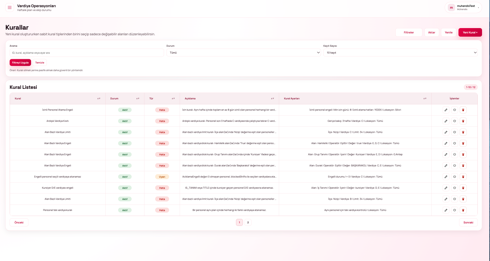

# MÜHENDİS

## 1.**Ana Sayfa / Dashboard**&#x20;

Sisteme giriş yapıldığında kullanıcıyı genel durum ekranı karşılar.

<figure><figcaption></figcaption></figure>

#### Sol Menü

Kullanıcının yetkisine göre aşağıdaki modüllere erişim sağlanır:

* Dashboard
* İcmal
* Hat-Sipariş
* Çalışan Bilgileri
* Kurallar

#### Üst Menü

* Kullanıcı bilgisi (sağ üst)
* Şifre değiştir / çıkış yap seçenekleri

### **1.1. Dashboard Detayları**

Dashboard, haftalık operasyonel verilerin özetini sunar.

<figure><figcaption></figcaption></figure>

#### Gösterilen Veriler

* Aktif Personel
* Atanan Personel
* Planlanan Mesai (Saat)
* Fazla Mesai (Saat)

#### Filtre Alanları

* Başlangıç Tarihi
* Bitiş Tarihi
* İcmal Haftası
* Lokasyon

#### KPI Kartları

* Vardiya listesi tamamlanma oranı
* Hat doluluk oranı
* Gelmeyen ekip oranı
* Mevcut - plan farkı

#### İşlemler

* **Excel’e Aktar:** Verileri dışa aktarır
* **Raporu Yenile:** Güncel veri getirir

### **1.2. Şifre Değiştirme Ekranı**

Kullanıcılar, sistemdeki şifrelerini güvenli şekilde güncelleyebilir.

* Sağ üst köşede yer alan kullanıcı menüsüne tıklanır
* Açılan menüden **“Şifre Değiştir”** seçilir

<figure><figcaption></figcaption></figure>

#### Alanlar

* **Mevcut Şifre:** Halihazırda kullanılan şifre girilir
* **Yeni Şifre:** Belirlenen yeni şifre girilir
* **Yeni Şifre (Tekrar):** Yeni şifre doğrulama amacıyla tekrar girilir

#### İşlemler

* **Şifreyi Güncelle:** Şifre değişikliğini kaydeder
* **Vazgeç:** İşlemi iptal eder

## 2. İcmal

İcmal ekranı, haftalık planların özetini sunar.&#x20;

Listede icmal başlangıç ve bitiş tarihleri, hafta bilgisi, atanan/toplam personel sayısı ve vardiya durumları görüntülenmektedir. Vardiya durumuna göre açık olan vardiyalara atama yapılabilirken, kapalı olanlara atama yapılamaz.&#x20;

Filtreler aracılığıyla yıl, hafta, personel aralıkları ve açık vardiya kriterlerine göre listeleme yapılabilir. Görüntüle ve vardiya atama işlemleri ile ilgili detay ve atama ekranlarına erişim sağlanabilmektedir.

<figure><figcaption></figcaption></figure>

### 2.1.İcmal Detay

Seçilen haftaya ait detaylı vardiya ve hat dağılımını gösterir.

Bu ekranda; müdürlük, bölüm, hat, hat açıklaması, vardiya bazlı personel sayıları ve toplam personel bilgileri görüntülenmektedir. Ek alanlar üzerinden sipariş ilişkili hatlar listesi incelenebilir, hat arama ve vardiya bazlı filtreleme yapılabilir.&#x20;

İcmale dön, vardiya atama, aktar ve yenile işlemleri ile ekran üzerinde gerekli aksiyonlar gerçekleştirilebilmektedir.

<figure><figcaption></figcaption></figure>

### 2.2. Vardiya Atama

Bu ekran vardiya planlamasının yapıldığı ana ekrandır.

**Yetki ve Kullanım:**

* Kullanıcı tüm hatları görüntüleyebilir.
* Planlama ve düzenleme yetkisi sadece kendi müdürlüğündeki hatlarla sınırlıdır.
* Filtre alanında yalnızca kendi sorumluluğundaki hatlar listelenir.

Hat adı ve açıklaması, hat sorumluları, vardiya bazlı personel listesi ve doluluk oranları görüntülenir. Vardiya saatleri A, B, C, D ve E vardiyalarına göre tanımlanmıştır. Personel atama ve çıkarma işlemleri yapılabilir, doluluk oranları takip edilebilir. Kapalı durumdaki vardiyalara atama yapılamamaktadır.

<figure><figcaption></figcaption></figure>

## 3. Hat - Sipariş

DB’den gelen haftalık sipariş verileri bu ekranda görüntülenir.

Listede aşağıdaki bilgiler yer almaktadır:

* Lokasyon
* Hat
* Planlama numarası
* Malzeme
* Miktar
* Personel sayısı
* Başlangıç / bitiş tarihi

Bu ekranda; lokasyon, hat, planlama numarası, malzeme, miktar, personel sayısı ve başlangıç/bitiş tarihi bilgileri görüntülenmektedir. Arama, vardiya, lokasyon ve yıl/hafta bazlı filtreleme yapılabilir ve kayıt sayısı seçilebilir.&#x20;

**İşlemler**

* **Filtrele:** Seçilen kriterlere göre verileri listeler
* **Temizle:** Uygulanan filtreleri sıfırlar
* **Excel’e aktar:** Listeyi Excel formatında dışa aktarır

<figure><figcaption></figcaption></figure>

## 4. Çalışan Bilgileri

Bu ekranda; personel numarası, ad-soyad, il/ilçe, engelli durumu, durak bilgisi, ünvan, iş tanımı, izin bilgisi, hamilelik durumu ve çalıştığı hat bilgileri görüntülenmektedir. Minimum 3 karakter ile arama yapılabilir, lokasyon ve hafta bazlı filtreleme uygulanabilir ve kayıt sayısı seçilebilir.

**İşlemler**

* ✏️ **Personel düzenleme:** Seçilen personel bilgilerini günceller
* **Listeleme ve filtreleme:** Belirlenen kriterlere göre kayıtlar görüntülenir

<figure><figcaption></figcaption></figure>

## 5. Kurallar

Vardiya atama sırasında geçerli olan sistem kurallarının yönetildiği alandır.

Listede aşağıdaki bilgiler yer almaktadır:

* Kural adı
* Durum (Aktif / Pasif)
* Tür (Hata / Uyarı)
* Açıklama
* Kural ayarları

**İşlemler:**

* **Düzenle:** Kural bilgilerini günceller
* **Aktif / Pasif yap:** Kuralın durumunu değiştirir
* **Sil:** Kural kaydını siler

<figure><figcaption></figcaption></figure>

### 5.1 Yeni Kural Ekleme

Yeni kural oluşturmak için kullanılır.

**Alanlar:**

* **Kural tipi:** Önceden tanımlı kural şablonlarından seçim yapılır
* **Kural kodu:** Kuralı sistemde benzersiz olarak tanımlayan koddur
* **Kural başlığı:** Kuralın kullanıcıya görünen adıdır
* **Durum:** Kuralın aktif veya pasif olduğunu belirler
* **Tür:** Kuralın hata mı yoksa uyarı mı vereceğini belirler
* **Lokasyon kapsamı:** Kuralın tüm lokasyonlarda mı yoksa seçili lokasyonlarda mı geçerli olacağını belirler
* **Açıklama:** Kural ile ilgili detaylı açıklama girilir

**Kural Ayarları**

* Vardiya seçimi yapılabilir (A, B, C, D, E)
* Kurala özel parametreler bu alanda belirlenir

<figure><figcaption></figcaption></figure>
