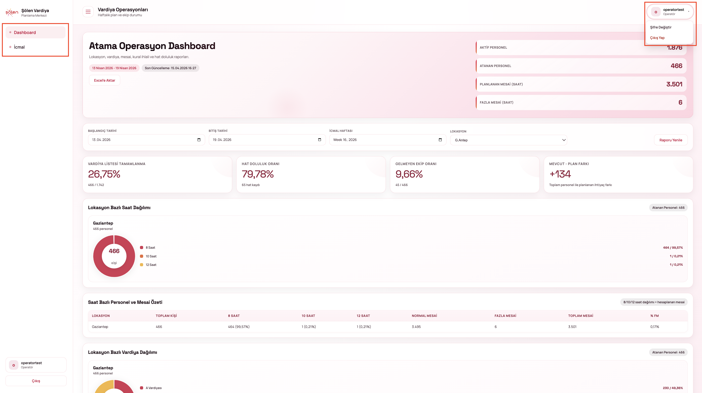
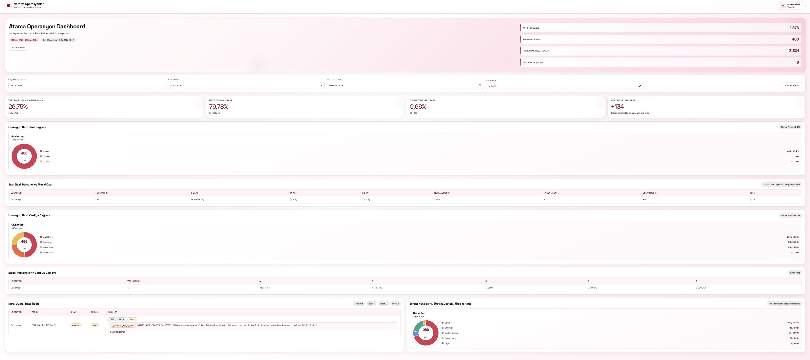
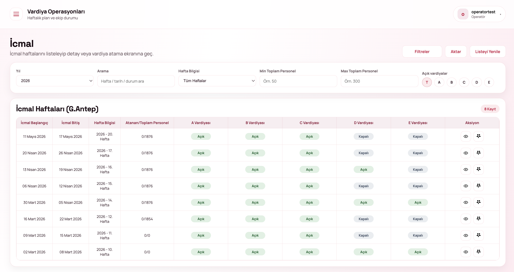

# OPERATOR

## 1.**Ana Sayfa / Dashboard**&#x20;

Sisteme giriş yapıldığında kullanıcıyı genel durum ekranı karşılar.

Operatör rolü sisteme giriş yaptığında yalnızca sınırlı menülere erişebilir

<figure><figcaption></figcaption></figure>

#### Sol Menü

* **Dashboard**
* **İcmal**

Operatör:

* Kural ekleyemez
* Çalışan bilgisi düzenleyemez
* Hat-sipariş ekranına erişemez

#### Üst Menü

* Kullanıcı bilgisi (sağ üst)
* Şifre değiştir / çıkış yap seçenekleri

### **1.1. Dashboard Detayları**

Dashboard, haftalık operasyonel verilerin özetini sunar.

<figure><figcaption></figcaption></figure>

#### Gösterilen Veriler

* Aktif Personel
* Atanan Personel
* Planlanan Mesai (Saat)
* Fazla Mesai (Saat)

#### Filtre Alanları

* Başlangıç Tarihi
* Bitiş Tarihi
* İcmal Haftası
* Lokasyon

#### KPI Kartları

* Vardiya listesi tamamlanma oranı
* Hat doluluk oranı
* Gelmeyen ekip oranı
* Mevcut - plan farkı

#### İşlemler

* **Excel’e Aktar:** Verileri dışa aktarır
* **Raporu Yenile:** Güncel veri getirir

### **1.2. Şifre Değiştirme Ekranı**

Kullanıcılar, sistemdeki şifrelerini güvenli şekilde güncelleyebilir.

* Sağ üst köşede yer alan kullanıcı menüsüne tıklanır
* Açılan menüden **“Şifre Değiştir”** seçilir

<figure><figcaption></figcaption></figure>

#### Alanlar

* **Mevcut Şifre:** Halihazırda kullanılan şifre girilir
* **Yeni Şifre:** Belirlenen yeni şifre girilir
* **Yeni Şifre (Tekrar):** Yeni şifre doğrulama amacıyla tekrar girilir

#### İşlemler

* **Şifreyi Güncelle:** Şifre değişikliğini kaydeder
* **Vazgeç:** İşlemi iptal eder

## 2. İcmal

İcmal ekranı haftalık planları listelemek için kullanılır.

Bu ekranda icmal başlangıç ve bitiş tarihleri, hafta bilgisi, atanan/toplam personel sayısı ve vardiya durumları görüntülenmektedir.&#x20;

Yıl, hafta, personel aralığı ve vardiya kriterlerine göre filtreleme yapılabilir. Detay görüntüleme ve vardiya atama işlemleri ile ilgili ekranlara erişim sağlanabilmektedir.

<figure><figcaption></figcaption></figure>

### 2.1 İcmal Detay

Seçilen haftanın detaylı planını gösterir.

Bu ekranda; müdürlük, bölüm, hat, hat açıklaması, vardiya bazlı personel sayıları ve toplam personel bilgileri görüntülenmektedir.&#x20;

Üst alanda sipariş eksik hatlar listesi yer almakta olup, hat ve vardiya bazlı filtreleme yapılabilmektedir.&#x20;

İcmale dön, vardiya atama, yenile ve aktar işlemleri ile ekran üzerindeki aksiyonlar gerçekleştirilebilmektedir.

<figure><figcaption></figcaption></figure>

### 2.2 Vardiya Atama

Bu ekranda tüm hatlar listelenmekte olup, vardiya bazlı personel dağılımı görüntülenmektedir.&#x20;

Hat adı ve açıklaması, hat sorumluları ve vardiya doluluk oranları kullanıcıya sunulmaktadır.&#x20;

Vardiya saatleri A, B, C, D ve E vardiyaları için tanımlanmıştır.&#x20;

<figure><figcaption></figcaption></figure>
